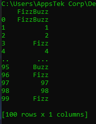



In [last week's blog](https://intelops.ai/blog/containers-containers-containers/), we had learned what containers were,
the benefits they offered, how they are built, and their use cases. This week, let's apply what we have learned on a
small sample project, to _containerize it_, and run it.

________________

# A Quick Refresher

As a quick recap of what we learned last week, `containers` are a type of virtualization technology that allow you to
run portable software on any machine. Containerized code can run on different machines, even if it was coded in a
certain environment. On top of this, containers are much lighter on the CPU, and faster than virtual machines.  
A container image is a package of the application code, its dependencies, and everything needed to run the application.
Creating a container image is the first step in creating a container. You can use one image to make numerous containers,
and container images are usually created using a DOCKERFILE.  
`Docker` is a software that allows you to build/run containers (a.k.a. a container runtime).  
Now that we have our basics covered, let's jump right into the tutorial.

# Installing Docker On Windows

1. Install Windows Subsystem Linux via the admin powershell command:
1. *wsl –install
2. Install Docker Desktop
3. Restart your computer.
4. Open Docker Desktop and go through the tutorial.
5. Once finished, you should see your deployed website on localhost:80.
6. You should also run the docker version command to see if you have both client and server side Docker installed.

# The Python App

The app we will be running is a simple script. It is a variation of the popular ‘FizzBuzz’ challenge found in
interviews. To add some complexity (dependencies), we will be creating a pandas dataframe, and filling a column with the
result of the fizzbuzz routine. The code will then print the data frame.  
The source code can be found [here](https://github.com/hannan-khan-intelops/docker_container_example/blob/main/app.py).
Go ahead and clone the app.py file into your own project directory that you have created, so we can turn it into a
Docker container.

# Dependencies/Requirements

You should create/copy the above script into a directory called “docker_container_example”.
Since Python allows for easy managing of requirements, all we have to do is create a requirements.txt within our project
directory. Within that, we can specify the pandas library to be used.

* pandas

# The `DOCKERFILE`

Within that same project directory, we will define a dockerfile with the name `.DOCKERFILE`. This will tell Docker which
container to use.
The dockerfile source code can be
found [here](https://github.com/hannan-khan-intelops/docker_container_example/blob/main/Dockerfile).

# Building An Image

Now that we have everything we will need in our directory, we can build our container image using our directory contents
and Dockerfile.  
Open a cmd within your projects directory, and issue the following command:

```shell
docker build --tag docker_example .
```

This builds an image with the tag `docker_example`.

# Running Your Container

Now that an image has been created (think of it as a template for creating containers from), you can finally create and
run a container using that image. To run, it's as simple as:

```shell
docker run docker_example
```

This will print out the FizzBuzz dataframe that our program created. The output should look similar to this:



Keep in mind that if the application was a web-based application, your container would be published at some address
which you can access. In fact, we will do that in the next section.

# Creating A Simple Flask Web-App To Be Deployed

In our project directory, we will create another python script for our web app. This script will be called web_app.py.
It will do the same thing as our previous command line app. The full contents of the script can be
found [here](https://github.com/hannan-khan-intelops/docker_container_example/blob/main/web_app.py).

## Updating Your `DOCKERFILE` & Creating A New Image

We need to update the dockerfile to include our new script only. This includes the new flask command, otherwise our
script will not run/publish correctly.
We need to update the requirements file to include everything from all scripts. This includes flask.
We need to build another image, to allow for our dockerfile changes to be reflected correctly.

```shell
docker build –tag docker_example_2 .
```

Finally, we can run our image docker_example_2:

```shell
docker run –publish 8888:8888 docker_example_2
```

Your app can now be accessed [here](http://localhost:8888/), and your output should look something like this:


**Note**: If you cannot see an app deployed, make sure the ports you specify in your Dockerfile are the same as the
ports you specified in your docker run command.

# Conclusion

In this blog, we created our first `DOCKERFILE`, container image, and container. We also learned what steps to take in
order to update our code, and recreate our image and container. Hopefully this tutorial has served its purpose of
getting you accustomed to working with `DOCKERFILES`, images, and containers.

> ## Full source code located [here](https://github.com/hannan-khan-intelops/docker_container_example).
